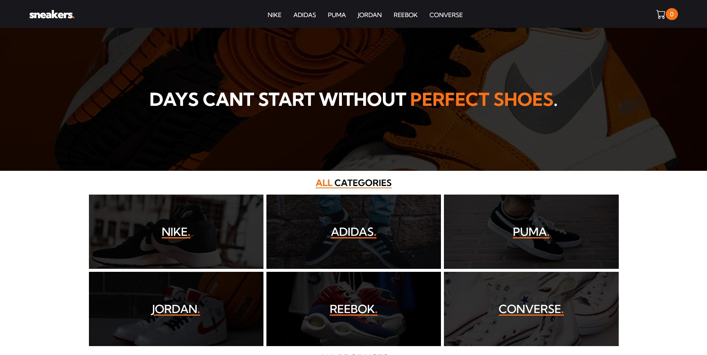
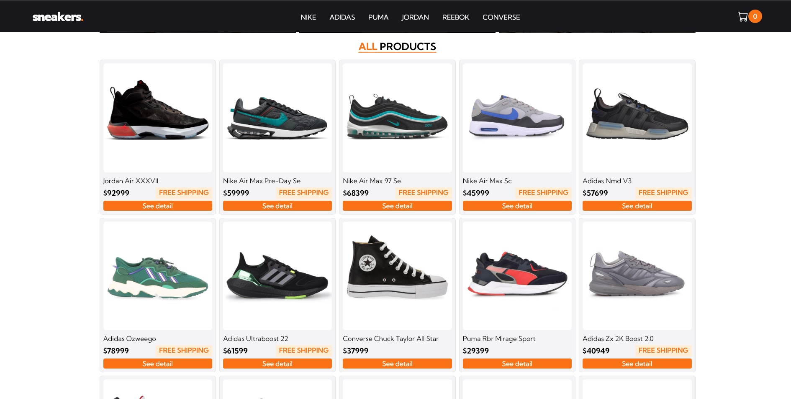
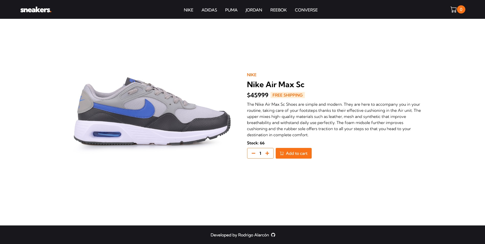

<h1>Sneakers Ecommerce</h1>

This is a project based on an Sneakers Ecommerce for Coderhouse's React JS course.

<h2>📄 Page preview</h2>

    
    
    

<h2>🛠️ Tools</h2>

     
    
    
    
    

    » react-icons  
    » react-router-dom  
    » sweetalert2  
    » react-toastify

